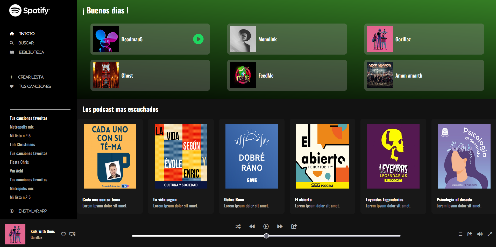
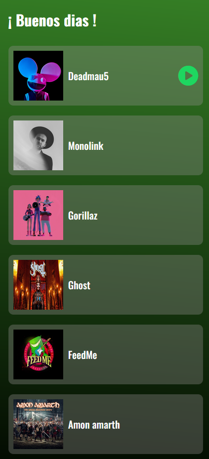
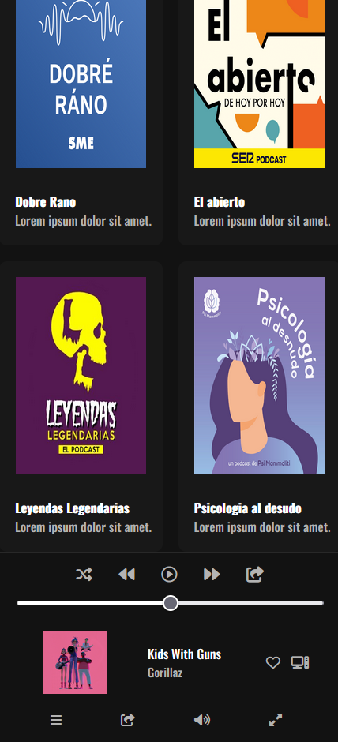

# SPOTIFY CLON
Clon de la pagina principal de Spotify, implementando el uso de flexbox , css grid y media querys para hacer una pagina completamente responsiva. 

###Visualizacion del sitio en Desktop###
Asi es como se vera nuestro clon visto desde cualquier navegador

###Responsive###
Visualizacion de nuestro sitio visto en cualquier dispositivo movil.

